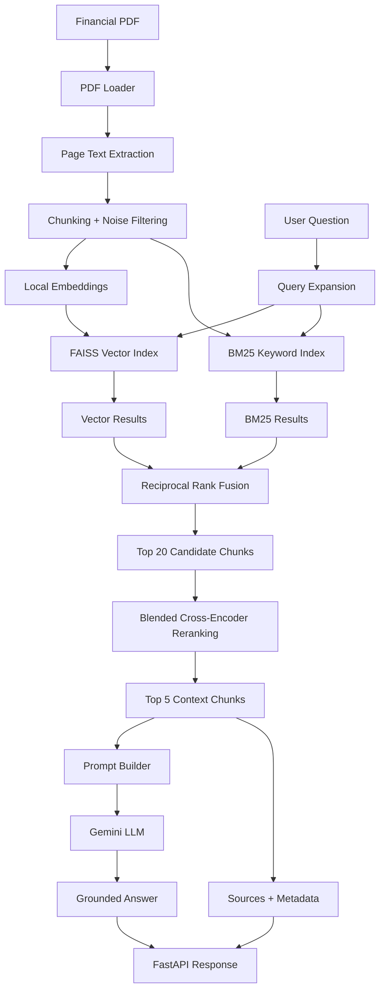

# FinSight AI — Financial Document Intelligence Assistant

FinSight AI is a production-style financial document intelligence assistant built using Retrieval-Augmented Generation (RAG). It allows users to upload financial PDFs such as annual reports, ask natural-language questions, and receive source-grounded answers backed by retrieved document chunks.

The project focuses on practical AI engineering concepts including document ingestion, chunking, embeddings, vector search, hybrid retrieval, reranking, LLM prompting, hallucination control, FastAPI backend development, evaluation, testing, and Docker-based deployment.

---

## Project Objective

Financial reports are long, dense, and difficult to analyze manually. Important information such as revenue, margins, dividends, risks, business segments, and management commentary is often spread across hundreds of pages.

FinSight AI solves this by building a source-grounded RAG pipeline:

```text
PDF → Text Extraction → Chunking → Embeddings → FAISS + BM25 Retrieval → Reranking → LLM Answer → Sources + Metadata
```

The goal is not to build a generic chatbot, but a financial document intelligence system that answers only from uploaded documents and refuses unsupported questions.

---

## Key Features

* PDF document ingestion
* Page-level text extraction using PyMuPDF
* Chunking with overlap and noise filtering
* Local embeddings using Sentence Transformers
* FAISS vector search
* BM25 keyword retrieval
* Multi-query expansion for financial report terminology
* Reciprocal Rank Fusion across retrievers
* Optional blended cross-encoder reranking
* Gemini-based answer generation
* Source-grounded answers
* Clean answer formatting without inline source pollution
* Fallback handling for unsupported questions
* FastAPI backend
* PDF upload endpoint
* Ask endpoint for document Q&A
* Structured response with sources and metadata
* Retrieval evaluation using Recall@K and MRR@K
* Full RAG answer smoke evaluation
* API tests using pytest
* Docker and Docker Compose support

---

## Why This Project Matters

This project demonstrates skills required for AI Engineer, GenAI Engineer, LLM Engineer, RAG Engineer, and AI/ML Engineer roles.

It covers the full path from raw unstructured documents to a working AI application:

```text
Document Processing
→ Embeddings
→ Retrieval
→ Reranking
→ Prompting
→ LLM Integration
→ API Design
→ Evaluation
→ Dockerization
```

Unlike a simple chatbot demo, FinSight AI includes retrieval evaluation, answer validation, fallback handling, reranking experiments, and production-style API responses.

---

## Tech Stack

| Area           | Tools                                           |
| -------------- | ----------------------------------------------- |
| Language       | Python                                          |
| API            | FastAPI, Uvicorn                                |
| PDF Parsing    | PyMuPDF                                         |
| Embeddings     | Sentence Transformers                           |
| Vector Search  | FAISS                                           |
| Keyword Search | BM25                                            |
| Ranking        | Reciprocal Rank Fusion, Cross-Encoder Reranking |
| LLM            | Gemini                                          |
| Evaluation     | Recall@K, MRR@K, Full RAG Smoke Evaluation      |
| Testing        | pytest, FastAPI TestClient                      |
| Deployment     | Docker, Docker Compose                          |

---

## Architecture



---

## RAG Pipeline

### 1. PDF Ingestion

The system reads uploaded PDFs and extracts page-level text.

```text
PDF → Pages → Text
```

Each page is stored with metadata such as:

```text
document_name
page_number
text
```

---

### 2. Chunking

Long pages are split into smaller chunks with overlap.

This improves retrieval because LLMs and embedding models perform better when each chunk focuses on a smaller section of text.

The project also filters noisy chunks such as very short footer-like content.

---

### 3. Embeddings

Each chunk is converted into a dense vector using Sentence Transformers.

Current embedding model:

```text
sentence-transformers/all-MiniLM-L6-v2
```

Embeddings are normalized and stored in FAISS.

---

### 4. Hybrid Retrieval

The project uses hybrid retrieval instead of only vector search.

It combines:

```text
FAISS semantic search
BM25 keyword search
Query expansion
Reciprocal Rank Fusion
```

This helps with financial reports because many answers depend on exact phrases, numbers, tables, and domain-specific terms.

Examples:

```text
dividend
buyback
revenue from operations
segmental operating margin
contractual liabilities
cybersecurity risks
```

---

### 5. Query Expansion

Financial reports often use formal terminology that differs from user wording.

For example:

```text
User asks: Who is the CEO?
Report says: Chief Executive Officer and Managing Director
```

The system expands queries using domain-aware financial terms, improving recall without hardcoding answers.

This is not answer hardcoding. It only improves search terms.

---

### 6. Reciprocal Rank Fusion

Results from FAISS and BM25 are combined using Reciprocal Rank Fusion.

```text
RRF score += 1 / (k + rank)
```

This allows results that appear high in multiple retrieval lists to rise in the final ranking.

---

### 7. Reranking

The project includes optional cross-encoder reranking.

A pure reranker was tested and found to reduce performance on the evaluation set. Instead of blindly keeping it, the project uses blended reranking:

```text
final_score = 0.7 * hybrid_score + 0.3 * reranker_score
```

This keeps the strong hybrid retrieval signal while allowing the reranker to improve ordering.

Current reranker model:

```text
cross-encoder/ms-marco-MiniLM-L-6-v2
```

Reranking is configurable through environment variables.

---

### 8. Prompting and Answer Generation

The retrieved chunks are passed to Gemini with strict grounding instructions.

The assistant must:

* Answer only from retrieved context
* Include exact numbers when available
* Clearly label standalone vs consolidated values
* Avoid unsupported assumptions
* Avoid inline source/page citations in the answer
* Return a fallback when the answer is not found

Fallback response:

```text
I could not find this information in the uploaded documents.
```

The API returns sources separately in a structured array.

---

## API Endpoints

### Health Check

```http
GET /health
```

Response:

```json
{
  "status": "ok",
  "service": "FinSight AI API"
}
```

---

### Upload Document

```http
POST /documents/upload
```

Uploads and indexes a PDF document.

Response example:

```json
{
  "message": "Document uploaded and indexed successfully.",
  "document_name": "infosys_annual_report.pdf",
  "pages_extracted": 382,
  "chunks_created": 756,
  "index_path": "/app/data/indexes/finsight.faiss",
  "metadata_path": "/app/data/indexes/chunks.json"
}
```

---

### Ask Question

```http
POST /ask
```

Request:

```json
{
  "question": "What dividend did Infosys announce?",
  "top_k": 5
}
```

Response:

```json
{
  "question": "What dividend did Infosys announce?",
  "answer": "Infosys announced the following dividends for the fiscal year ended March 31, 2026:\n\n* An interim dividend of ₹23 per equity share.\n* A final dividend of ₹25 per share, which is subject to shareholders' approval in the ensuing Annual General Meeting (AGM).\n* The total dividend for fiscal 2026 is ₹48 per share.",
  "sources": [
    {
      "document_name": "infosys_annual_report.pdf",
      "page_number": 36,
      "chunk_id": "infosys_annual_report.pdf_p36_c3",
      "score": 0.909736047441413
    },
    {
      "document_name": "infosys_annual_report.pdf",
      "page_number": 361,
      "chunk_id": "infosys_annual_report.pdf_p361_c3",
      "score": 0.8270556172637941
    }
  ],
  "metadata": {
    "top_k": 5,
    "min_score": 0.025,
    "best_score": 0.909736047441413,
    "best_retrieval_score": 0.16299627523230203,
    "best_final_score": 0.909736047441413,
    "retrieved_chunks": 5,
    "retrieval_strategy": "hybrid_faiss_bm25_rrf_blended_rerank",
    "llm_provider": "gemini",
    "is_answer_found": true,
    "fallback_reason": null
  }
}
```

---

## Fallback Example

Request:

```json
{
  "question": "What is the CEO's favorite cricket team?",
  "top_k": 5
}
```

Response:

```json
{
  "question": "What is the CEO's favorite cricket team?",
  "answer": "I could not find this information in the uploaded documents.",
  "sources": [],
  "metadata": {
    "is_answer_found": false,
    "fallback_reason": "llm_could_not_answer_from_context"
  }
}
```

This demonstrates hallucination control. Even if related CEO chunks are retrieved, the system refuses to answer when the exact information is not present in the document.

---

## Evaluation

FinSight AI includes two types of evaluation.

---

### 1. Retrieval Evaluation

The retrieval evaluation checks whether expected source pages appear in the top retrieved chunks.

Metrics:

```text
Recall@K
MRR@K
```

Current curated evaluation set:

```text
26 answerable annual-report questions
5 unanswerable questions
```

Final retrieval configuration:

```text
Hybrid FAISS + BM25 + RRF + blended reranking
```

Results:

```text
Recall@5: 100.00%
MRR@5: 77.88%
```

Important: These metrics are based on a curated evaluation set and should not be interpreted as universal accuracy.

---

### 2. Full RAG Smoke Evaluation

The full RAG evaluation checks end-to-end system behavior:

```text
Question
→ Retrieval
→ Reranking
→ Gemini Answer
→ Sources
→ Metadata
→ Fallback Handling
```

It validates:

* Expected answer terms are present
* Expected source pages are present
* Answerable questions return `is_answer_found = true`
* Unanswerable questions return `is_answer_found = false`
* Fallback answers return `sources = []`
* Answers do not leak inline source/page/chunk citations

Current result:

```text
Total questions: 6
Passed: 6
Pass rate: 100.00%

Answerable pass rate: 100.00%
Unanswerable pass rate: 100.00%
```

---

## Reranking Experiment

The project evaluates reranking instead of blindly assuming it improves retrieval.

Results:

| Retrieval Mode               | Recall@5 | MRR@5  |
| ---------------------------- | -------- | ------ |
| Hybrid FAISS + BM25 + RRF    | 96.15%   | 73.72% |
| Pure Cross-Encoder Reranking | 88.46%   | 67.24% |
| Blended Reranking            | 100.00%  | 77.88% |

Conclusion:

```text
Pure reranking reduced performance.
Blended reranking improved performance.
```

Final scoring:

```text
final_score = 0.7 * hybrid_score + 0.3 * reranker_score
```

---

## Project Structure

```text
finsight-ai/
│
├── data/
│   ├── raw/
│   ├── indexes/
│   └── evaluation/
│
├── scripts/
│   ├── ingest_document.py
│   ├── ask.py
│   ├── search.py
│   ├── keyword_search.py
│   ├── evaluate_retrieval.py
│   └── evaluate_rag_answers.py
│
├── src/
│   └── finsight/
│       ├── api/
│       │   ├── main.py
│       │   └── schemas.py
│       │
│       ├── embeddings/
│       │   └── embedder.py
│       │
│       ├── ingestion/
│       │   ├── chunker.py
│       │   ├── pdf_loader.py
│       │   └── service.py
│       │
│       ├── rag/
│       │   ├── bm25_retriever.py
│       │   ├── llm_client.py
│       │   ├── pipeline.py
│       │   ├── prompt.py
│       │   ├── query_expander.py
│       │   ├── reranker.py
│       │   └── retriever.py
│       │
│       ├── vector_store/
│       │   └── faiss_store.py
│       │
│       ├── config.py
│       └── schemas.py
│
├── tests/
│   └── test_api.py
│
├── Dockerfile
├── docker-compose.yml
├── .dockerignore
├── requirements.txt
└── README.md
```

---

## Environment Variables

Create a `.env` file in the project root.

```env
GEMINI_API_KEY=your_gemini_api_key_here
GEMINI_MODEL=gemini-2.5-flash
LLM_PROVIDER=gemini

EMBEDDING_MODEL_NAME=sentence-transformers/all-MiniLM-L6-v2

USE_RERANKER=true
RERANK_TOP_K=20
RERANKER_MODEL_NAME=cross-encoder/ms-marco-MiniLM-L-6-v2
RERANKER_HYBRID_WEIGHT=0.7
RERANKER_MODEL_WEIGHT=0.3
```

Do not commit `.env` to GitHub.

---

## Running Locally

### 1. Create virtual environment

```bash
python -m venv .venv
source .venv/bin/activate
```

### 2. Install dependencies

```bash
pip install -r requirements.txt
```

### 3. Start FastAPI server

```bash
uvicorn src.finsight.api.main:app --reload
```

Open:

```text
http://localhost:8000/docs
```

---

## Running with Docker

### 1. Build image

```bash
docker compose build
```

### 2. Start API

```bash
docker compose up -d
```

### 3. View logs

```bash
docker compose logs -f
```

### 4. Open API docs

```text
http://localhost:8000/docs
```

### 5. Stop container

```bash
docker compose down
```

---

## Docker Notes

The Docker setup:

* Runs the FastAPI API inside a container
* Mounts the local `data/` directory into the container
* Caches Hugging Face models using a Docker volume
* Reads configuration from `.env`
* Supports Gemini-based answer generation
* Supports FAISS indexes stored under `data/indexes`

The API was verified inside Docker using:

```bash
curl -X POST "http://localhost:8000/ask" \
  -H "Content-Type: application/json" \
  -d '{
    "question": "What dividend did Infosys announce?",
    "top_k": 5
  }'
```

---

## Running Tests

```bash
pytest
```

The API tests validate:

* Health endpoint
* Ask endpoint response structure
* Request validation
* Upload validation
* Metadata format

---

## Running Retrieval Evaluation

```bash
python -m scripts.evaluate_retrieval --top-k 5
```

Run blended reranking evaluation:

```bash
python -m scripts.evaluate_retrieval --top-k 5 --use-reranker --candidate-k 20
```

---

## Running Full RAG Answer Evaluation

```bash
python -m scripts.evaluate_rag_answers
```

This evaluates end-to-end RAG behavior including answers, sources, fallback handling, and citation cleanliness.

---

## Example Questions

```text
What dividend did Infosys announce?
What was Infosys' consolidated revenue from operations in fiscal 2026?
What are the geographical revenue segments?
What are the business segments of Infosys?
What are the cybersecurity risks mentioned?
Who is the CEO of Infosys?
What is Infosys Topaz Fabric?
What does Infosys say about AI agents?
```

Unsupported questions:

```text
What is the CEO's favorite cricket team?
What is Infosys planning to do in Mars colonization?
```

The system should return the fallback answer for unsupported questions.

---

## Key Engineering Decisions

### Why FAISS?

FAISS provides fast similarity search over dense embeddings and is suitable for local vector search in a portfolio-grade RAG system.

### Why BM25?

Financial reports contain exact terminology, numbers, and table labels. BM25 improves retrieval for exact-match queries such as dividend, buyback, revenue from operations, and payout ratio.

### Why RRF?

Reciprocal Rank Fusion combines rankings from multiple retrievers without needing score calibration between FAISS and BM25.

### Why blended reranking?

A pure cross-encoder reranker reduced performance on the evaluation set. Blended scoring preserved the hybrid retriever’s strength while allowing the reranker to improve ranking.

### Why source-grounded fallback?

The system should not answer questions unsupported by the document. If the retrieved context does not contain the answer, it returns a controlled fallback response.

---

## Limitations

* Currently optimized for annual-report style financial PDFs
* Evaluation set is curated and relatively small
* Tables are handled as extracted text, not structured table objects
* Multi-document management is basic
* No frontend yet
* No authentication
* No PostgreSQL persistence yet
* LLM answers depend on Gemini API availability

---

## Future Improvements

* Multi-document index management
* Document listing and deletion endpoints
* Structured table extraction
* Financial metric extraction into database tables
* PostgreSQL-backed metadata and chat history
* Frontend UI for document upload and Q&A
* More extensive RAG evaluation set
* Faithfulness scoring
* Citation correctness evaluation
* LangGraph-based controlled agentic workflows
* Text-to-SQL over extracted financial metrics
* Cloud deployment

---
## Project Highlights

Possible resume bullets:

```text
Built a source-grounded financial document intelligence assistant using RAG, FastAPI, FAISS, BM25, Sentence Transformers, Gemini, and Docker.

Implemented hybrid retrieval using FAISS vector search, BM25 keyword search, query expansion, and Reciprocal Rank Fusion for financial annual reports.

Evaluated retrieval performance using Recall@5 and MRR@5 on a curated annual-report evaluation set.

Implemented and compared pure cross-encoder reranking against blended reranking, improving Recall@5 from 96.15% to 100.00%.

Designed hallucination guardrails with context-only prompting, fallback responses, empty sources on unsupported answers, and structured metadata.

Containerized the RAG API with Docker Compose, mounted document/index volumes, and cached Hugging Face models for repeatable local deployment.
```

---

## Disclaimer

FinSight AI is a technical AI engineering project. It is not financial advice, investment advice, or a substitute for professional financial analysis.
